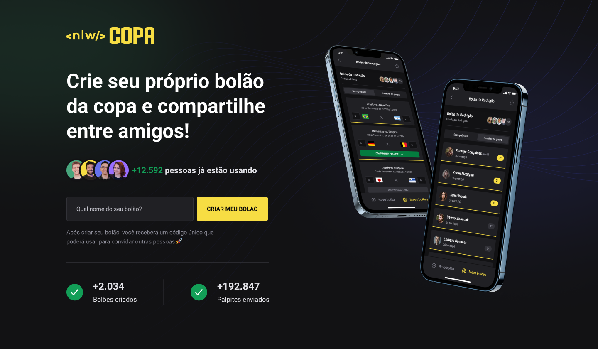

<h1>Bolão da Copa do Mundo</h1>

[**Sobre**](#-sobre)

  
  
Esse projeto foi desenvolvido durante o envento NLW-COPA da rocketseat, onde criamos uma plataforma de bolão para os jogos da Copa do Mundo
 
  
Nesse projeto foram desenvolvidos plataformas web e mobile onde podemos logar com uma conta google e criar nosso bolão e dar vários palpites!

[**Tecnologias usadas**](#-Tecnologias usadas)

  <ul>
    <li>Node.js</li>
    <li>Fastify</li>
    <li>Typescript</li>
    <li>Prisma</li>
    <li>React.js</li>
    <li>React Native</li>
  </ul>

